# Get Started With First Job!
This guide is for end-users who want to replicate data between the various sources and destinations that OLake supports. Using the OLake UI, you can configure a **source**, set up a **destination**, and create a **job** to move data between them.

By the end of this tutorial, you’ll have a complete replication workflow running in OLake.

## Prerequisites

Follow the [Quickstart Setup Guide](/docs/getting-started/quickstart) to ensure the OLake UI is running at [localhost:8000](http://localhost:8000) 

###  What is a Job?
A job in OLake is a pipeline that defines how data should be synchronized from a **source** (where your data comes from) to a **destination** (where your data goes). 

Sources and destinations can be:
- **New** - configured during job creation.
- **Existing** - already set up and reused across multiple jobs.

### Two ways to create a Job

#### 1. Job-first workflow:
Start from the **Jobs** page and set up everything in one flow.
1. Go to **Jobs** in the left menu and click **Create Job**.
1. Configure the **source**.
1. Configure the **destination**.
1. Configure streams, schedule, and save.

#### 2. Resource-first workflow:
Set up your source and destination first, then link them in a job.
1. Create a source from the **Sources** page.
1. Create a destination from the **Destinations** page.
1. Go to **Jobs → Create Job**, and select the existing source and destination.
1. Configure streams, schedule, and save.

:::tip
The two methods achieve the same result. Choose **Job-first** if you want a guided setup in one go. 
Choose **Resource-first** if your source and destination are already configured, or if you prefer to prepare them in advance.
:::

 

## Tutorial: Creating a Job
In this guide, we'll use the **Job-first workflow** to set up a job from configuring the source and destination to running it. If you prefer video, check out our [video walkthrough](#video-tutorial).

First things first, every job needs a source and a destination before it can run. 
For this demonstration, we'll use **Postgres** as the source and **Iceberg with Glue catalog** as the destination. 

Let's get started!

### 1. Create a New Job
Navigate to **Jobs** section and select **+ Create Job** button in the top right corner. This opens the Job creation wizard, starting with the **source configuration** step.

    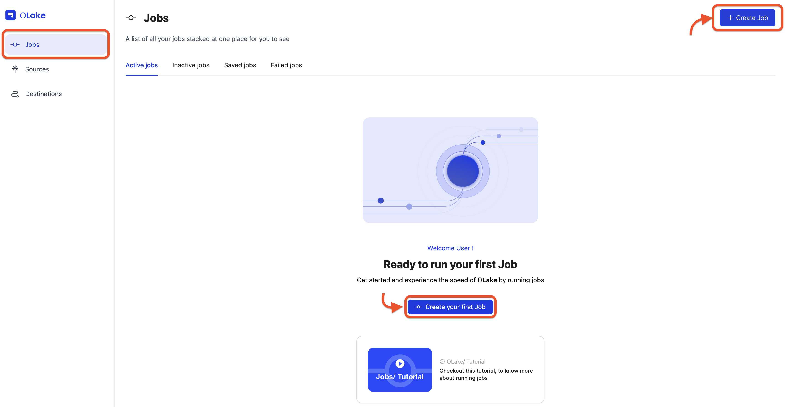

### 2. Configure Source

Since we're following the **Job-first workflow**, select the **Set up a new source** option.

For this guide, choose **Postgres** from the connector dropdown, and keep the **OLake version** set to the latest stable version. 

    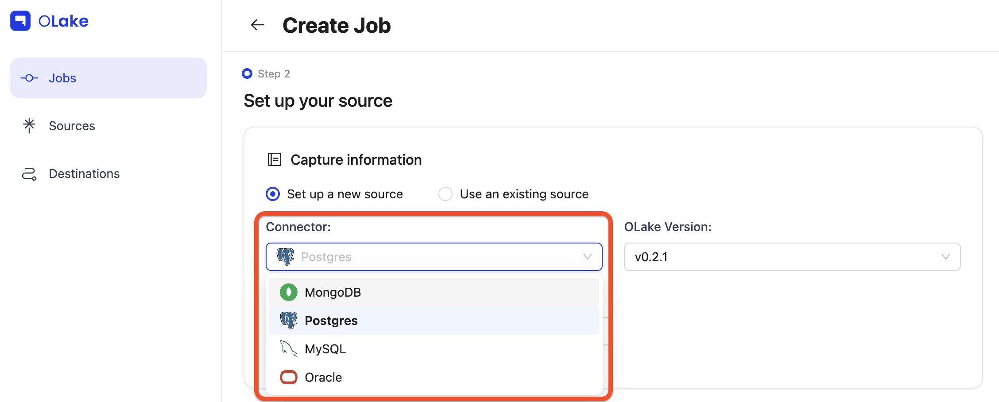

Give your source a descriptive name, then fill in the required Postgres connection details in the Endpoint Config form.

  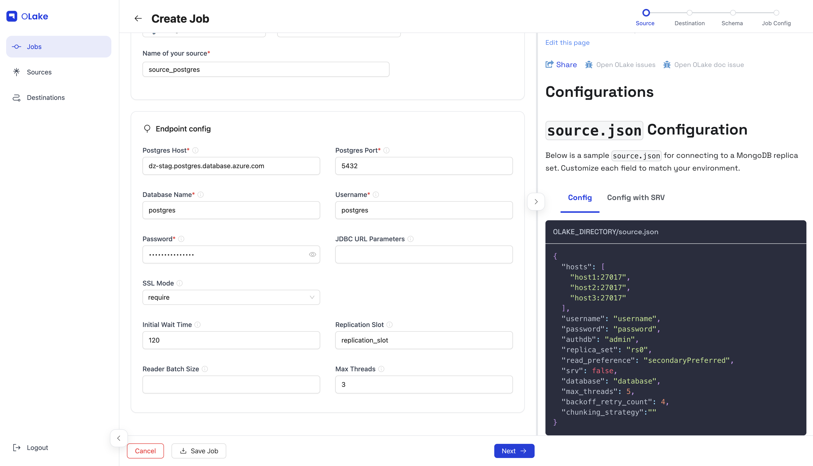

Once the test connection succeeds, OLake shows a success message and takes you to the destination configuration step. 

You can find the configuration and troubleshooting guides for all supported source connectors below.

| Sources  | Config                                             | Destination                                                  |
|----------|----------------------------------------------------|--------------------------------------------------------------|
| MySQL    | [Config](/docs/connectors/mysql#configuration)    | [Troubleshooting](/docs/connectors/mysql#troubleshooting)    |
| Postgres | [Config](/docs/connectors/postgres#configuration) | [Troubleshooting](/docs/connectors/postgres#troubleshooting) |
| MongoDB  | [Config](/docs/connectors/mongodb#configuration)  | [Troubleshooting](/docs/connectors/mongodb#troubleshooting)  |
| Oracle   | [Config](/docs/connectors/oracle#configuration)   | [Troubleshooting](/docs/connectors/oracle#troubleshooting)   |

:::note
If you plan to enable CDC (Change Data Capture), make sure a replication slot already exists on your Postgres database. 
You can learn how to check or create one in our [Replication Slot Guide](/docs/connectors/postgres/setup/generic).
:::

### 3. Configure Destination

Similarly, here we'll be using **Iceberg** with **AWS Glue Catalog** as the destination. 

For this guide, select **Apache Iceberg** from the connector dropdown, and keep the **OLake version** set to the latest stable version.

  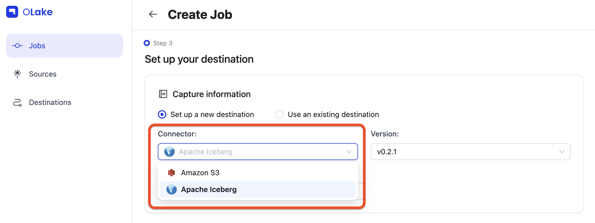

Choose the catalog as **AWS Glue** from the Catalog dropdown.

  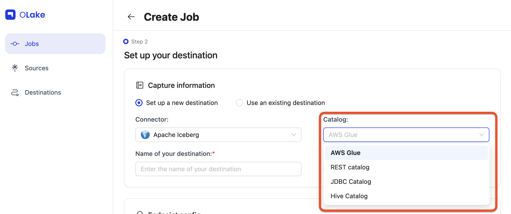

Give your destination a descriptive name, then fill in the required connection details in the Endpoint Config form.

  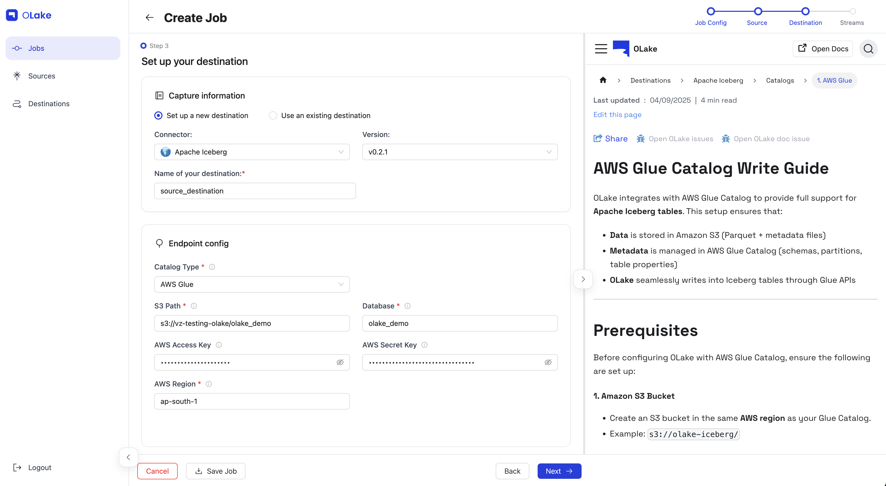

Once the test connection succeeds, OLake shows a success message and takes you to the streams configuration step. 

You can find the configuration and troubleshooting guides for all supported destination connectors below.

- **Parquet S3**
    | Destinations     | Config                                                               | Troubleshooting                                                                               |
    |------------------|----------------------------------------------------------------------|-----------------------------------------------------------------------------------------------|
    | Parquet          | [Config](/docs/writers/parquet/config)                               | [Troubleshooting](/docs/writers/parquet/troubleshoot)                           |

- **Iceberg**
  | Catalogs         | Config                                                                              | Troubleshooting                                                                               |
  |------------------|-------------------------------------------------------------------------------------|-----------------------------------------------------------------------------------------------|
  | AWS Glue Catalog | [Config](/docs/writers/iceberg/catalog/glue#configuration)                          | [Troubleshooting](/docs/writers/iceberg/catalog/glue#troubleshooting)                         |
  | Hive Catalog     | [Config](/docs/writers/iceberg/catalog/hive#configuration)                          |  [Troubleshooting](/docs/writers/iceberg/catalog/hive#troubleshooting)                         |
  | JDBC Catalog     | [Config](/docs/writers/iceberg/catalog/jdbc#configuration)                          | [Troubleshooting](/docs/writers/iceberg/catalog/jdbc#troubleshooting)                         |
  | REST Catalog     | [Config](/docs/writers/iceberg/catalog/rest?rest-catalog=generic#configuration)     | [Troubleshooting](/docs/writers/iceberg/catalog/rest?rest-catalog=generic#troubleshooting)    |
  | Nessie Catalog   | [Config](/docs/writers/iceberg/catalog/rest?rest-catalog=nessie#configuration)      | [Troubleshooting](/docs/writers/iceberg/catalog/rest?rest-catalog=nessie#troubleshooting)     |
  | LakeKeeper       | [Config](/docs/writers/iceberg/catalog/rest?rest-catalog=lakekeeper#configuration)  | [Troubleshooting](/docs/writers/iceberg/catalog/rest?rest-catalog=lakekeeper#troubleshooting) |
  | S3 Tables        | [Config](/docs/writers/iceberg/catalog/rest?rest-catalog=s3-tables#configuration)   | [Troubleshooting](/docs/writers/iceberg/catalog/rest?rest-catalog=s3-tables#troubleshooting)  |
  | Polaris          | [Config](/docs/writers/iceberg/catalog/rest?rest-catalog=polaris#configuration)     | [Troubleshooting](/docs/writers/iceberg/catalog/rest?rest-catalog=polaris#troubleshooting)    |
  | Unity            | [Config](/docs/writers/iceberg/catalog/rest?rest-catalog=unity#configuration)       | [Troubleshooting](/docs/writers/iceberg/catalog/rest?rest-catalog=unity#troubleshooting)      |

### 4. Configure Streams

The **Streams** page is where you select which streams to replicate to the destination.
Here, you can choose your preferred [sync mode](/docs/understanding/terminologies/olake#2-sync-modes) and configure [partitioning](/docs/writers/parquet/partitioning) as well as other stream-level settings here.

  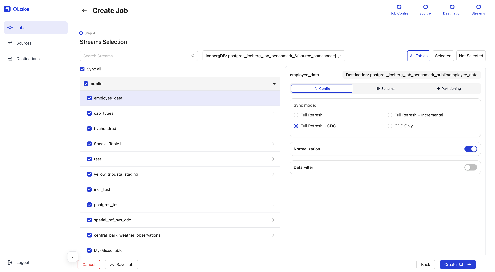

For this guide, we'll configure the following:
- Replicate the `fivehundred` stream (name of the table).
- Use **Full Refresh + CDC** as the sync mode.
- Enable **data Normalization**.
- Replicate only data where `dropoff_datetime` >= `2010-01-01 00:00:00` (basically data from 2010 onward).
- Partition the data by the **year** extracted from a timestamp column in the selected stream.
- Run the sync every day at 12:00 AM.

Let's start by selecting the `fivehundred` stream (or any stream from your source) by checking its checkbox to include it in the replication.
Click the stream name to open the stream-level settings panel on the right side.
In the panel, set the **sync mode** to **Full Refresh + CDC**, and enable **Normalization** by toggling the switch on.

  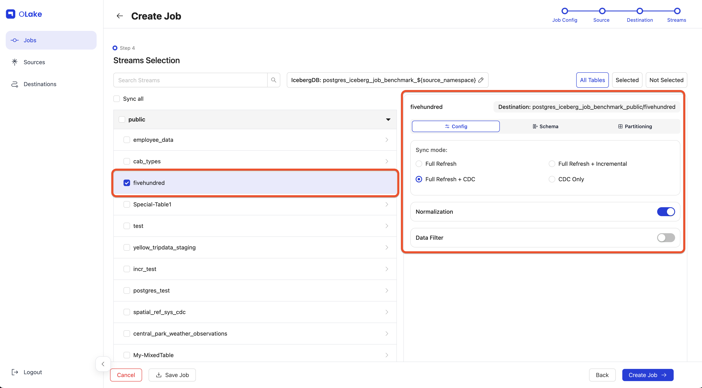

To learn more about sync modes, refer to our [Sync Modes Guide](/docs/understanding/terminologies/olake#2-sync-modes) in the documentation.

To partition the data, click the **Partitioning** tab and configure it based on the required details.
In our case, the `fivehundred` stream has a timestamp column named `dropoff_datetime`, which we will partition by **year**. Learn more about partitioning in the [Partitioning Guide](/docs/writers/parquet/partitioning).

  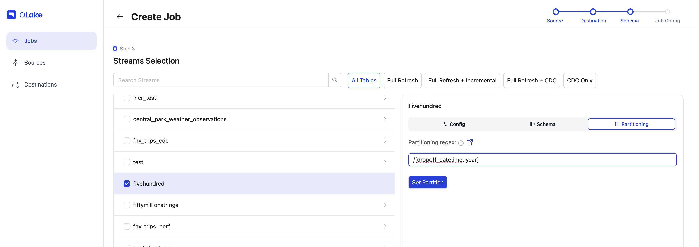

To replicate only data from 2010 onward, we'll use a **Data Filter** to filter the data based on the `dropoff_datetime` column. 
Make sure the **Value** provided is in the same format as the column schema.

  

  After completing all configurations, click **Next** to proceed to the final step: **Job Config**.

### 5. Schedule Job

Give your job a descriptive name. For this guide, set the **Frequency** dropdown to **Every Day** and choose **12:00 AM** as the **Time**.

  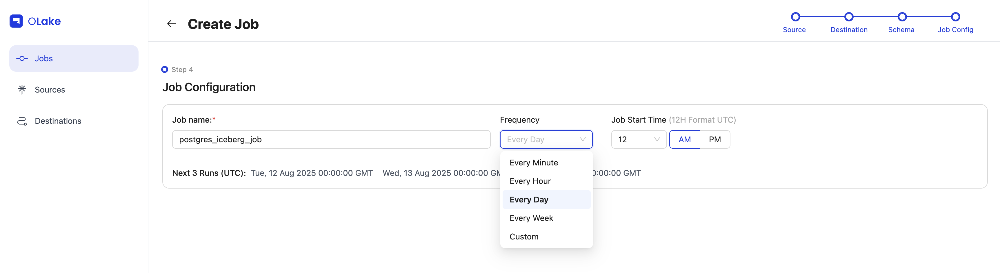

Once configured, click **Create Job** in the bottom-right corner. Tada! you've successfully created your first job!

  

The sync will start at the next scheduled time. You can also start it manually by going to the **Jobs** section, finding your job, clicking the options menu, and selecting **Sync Now**.

  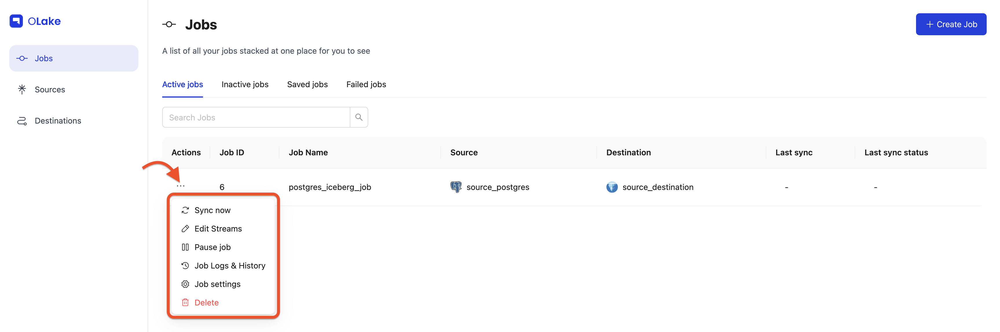

You can verify the sync status by checking the badge at the right end of the job row. Possible statuses include **Running**, **Failed**, and **Completed**. 
You can also monitor the sync logs by selecting [**Job Logs and History**](/docs/getting-started/creating-first-pipeline#4-job-logs--history) from the job options menu.

- Job running:
  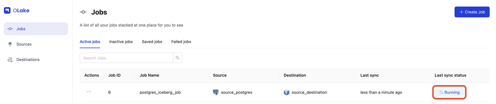

- Job completed:
  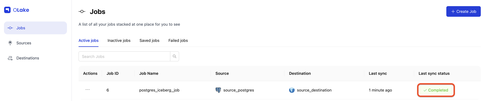

Yay! The sync is complete, and our data has been replicated to Iceberg exactly as we configured it.

  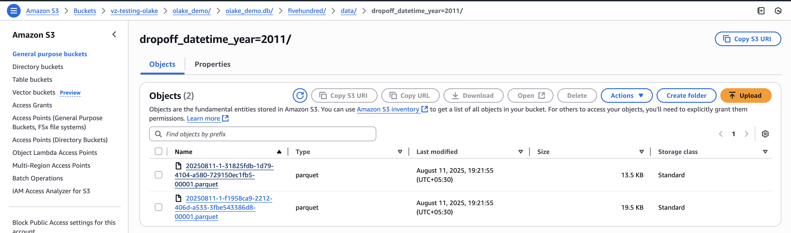

 

### 6. Manage Your Job 
Once your job is created, you can manage it from the **Jobs** page using the **Actions** menu **(⋮)**

Here's what each option does:

#### 1. Sync Now
Run the job immediately without waiting for the next scheduled time.

#### 2. Edit Streams
Use this option to modify which streams are included in your job and adjust their replication settings.
When you click **Edit Streams** you'll be redirected to the **Stream Configuration** page.

Here you can:

- **Add new streams** from your source.
- **Change the sync mode** for selected streams.
- **Adjust partitioning** or **Normalization** for newly added streams.
- You can also navigate to **Source** and **Destination** settings using the stepper at the top-right of the page. 

  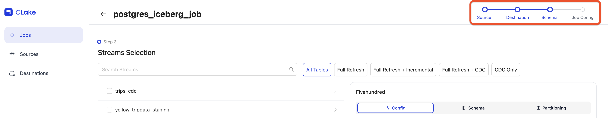

- By default, source and destination editing is locked click **Edit** to unlock them.

  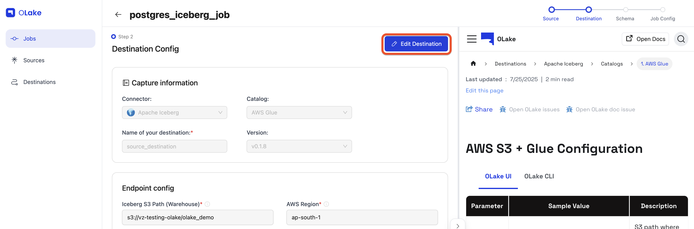

:::note
You cannot directly change the **Normalization**, **data filter**, or **partition scheme** for existing streams. To update these:
1. Unselect the stream.
1. Save the job.
1. Reopen **Edit Streams** and re-add the stream with the updated settings
:::

#### 3. Pause Job
Stops the job from running until resumed. Paused jobs appear under **Inactive Jobs**. Resume them anytime from the **Inactive Jobs** tab.

  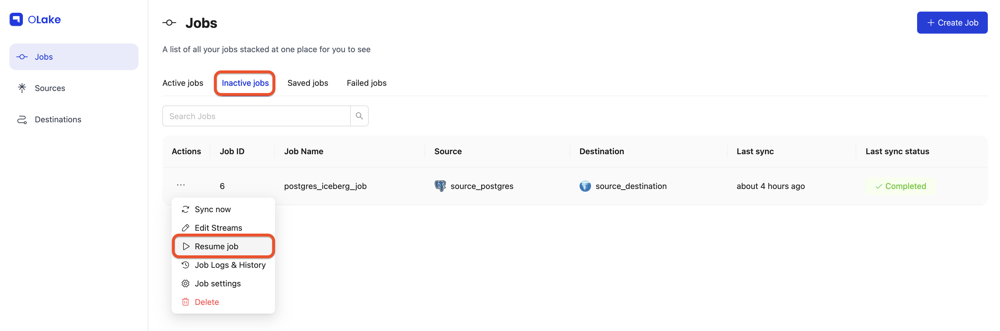

#### 4. Job Logs & History
This page lets you view and monitor a job's sync history and logs. You'll see a list of all current and past job runs.
To view logs for a specific run, click **View Logs** in the Actions column.

  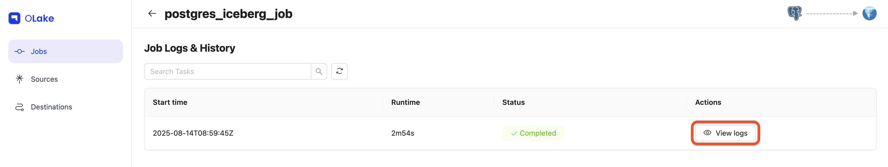

Once you click **View Logs**, you'll see the logs for the selected job run.

  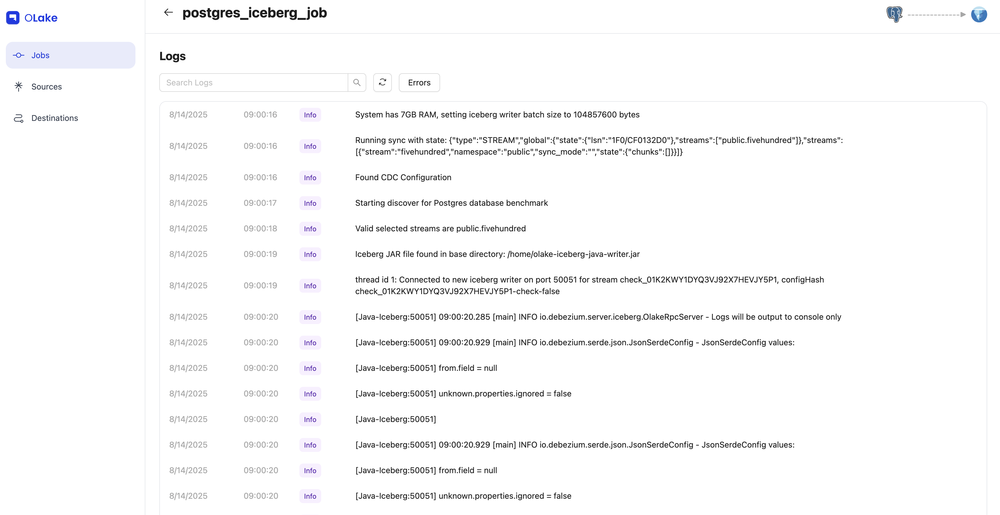

#### 5. Job settings
Here, you can edit the job's name, frequency, and other configuration settings.
You can also pause or delete the job.

When a job is deleted, its associated source and destination are automatically moved to the inactive state, provided they are not being used by any other job.

  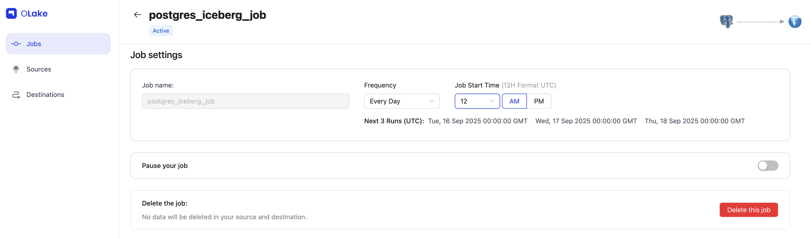

## Video Tutorial

    <video 
    controls 
    className="max-w-4xl w-full rounded-lg shadow-lg"
    preload="metadata"
    >
        <source src="/img/docs/getting-started/create-your-first-job/create-your-first-job-video.mp4" type="video/mp4" />
        Your browser does not support the video tag.
    </video>

